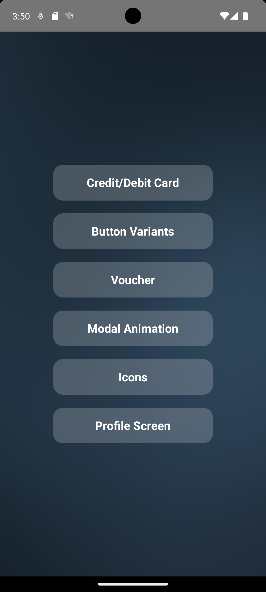
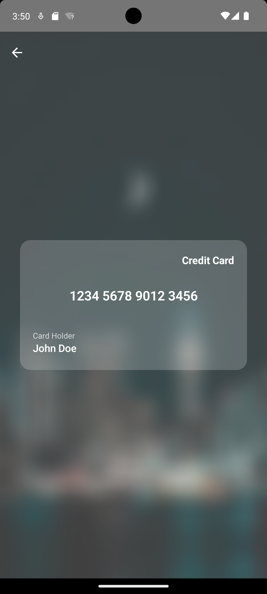
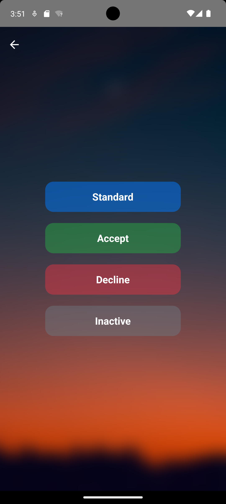
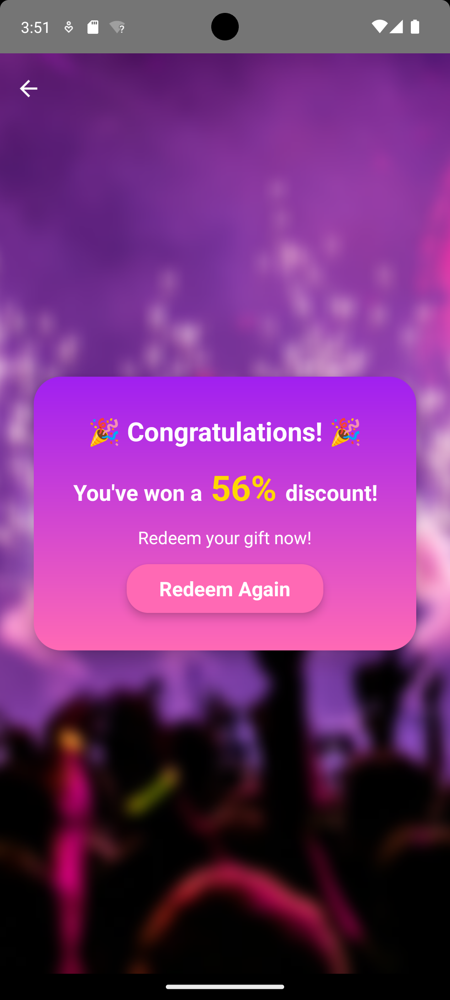
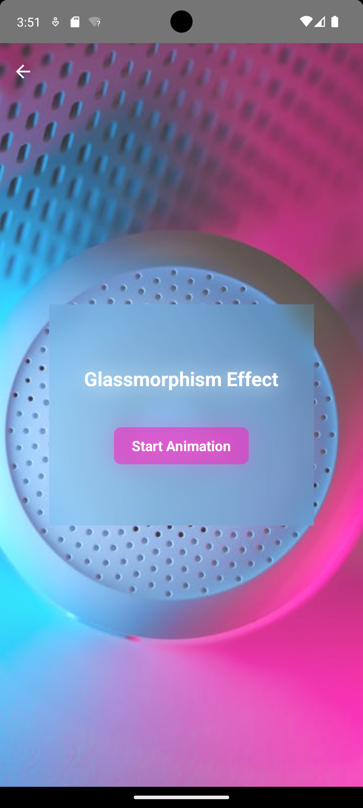
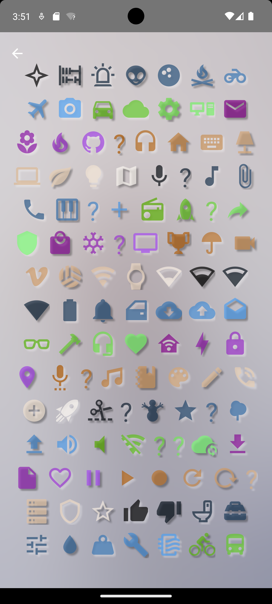
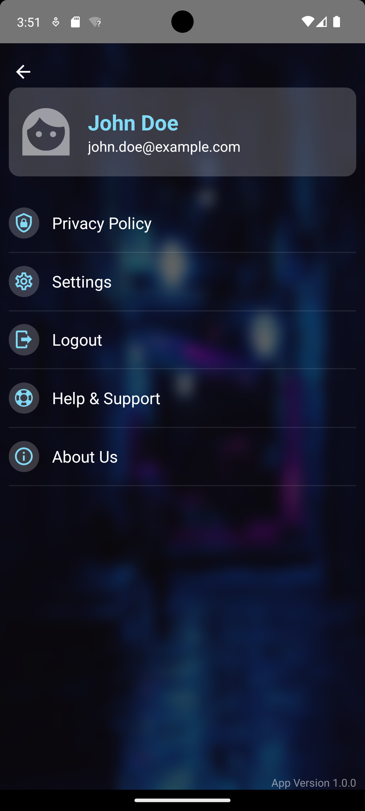

# GlassMorphism React Native App

This project demonstrates a **React Native** app implementing a **Glassmorphism effect** across multiple screens, showcasing a visually appealing UI with frosted glass-like elements. The app contains several screens, each designed with a different focus while maintaining the glassmorphism theme.

## What is Glassmorphism?

**Glassmorphism** is a design trend that revolves around creating a frosted glass-like effect, typically characterized by:

- **Blurry backgrounds**: The background is blurred behind a semi-transparent, frosted glass-like surface.
- **Vibrant colors**: Transparent surfaces are often layered on colorful or dynamic backgrounds to create visual contrast.
- **Smooth, modern feel**: This effect gives a sleek, polished, and contemporary look to user interfaces.

Glassmorphism is often used in modern web and mobile apps to give them a soft, translucent, and futuristic feel, making the UI feel less static and more fluid.

## Screenshots

### Home Screen

The Home Screen serves as the landing page, introducing the app and featuring the primary options to navigate between screens .



### Card Screen

The Card Screen displays information within cards, all designed with glassmorphism, creating a translucent, blurred background effect.



### Button Variants

This screen shows various button types designed using the glassmorphism style, offering multiple interactive button styles.



### Voucher

The Voucher screen features a dynamic system where the voucher percentage value is randomly changed each time it is accessed. This functionality provides a unique and engaging user experience, with the frosted glass effect complementing the modern and sleek design.



### Modal Animation

The Modal Animation screen demonstrates smooth modal transitions with **ease-in** and **ease-out** effects. This provides an interactive experience with visually appealing animations, adding to the app's smooth, modern feel while maintaining the glassmorphism aesthetic.



### Icons

The Icons screen presents a collection of icons, displayed in a grid with dark and white shadows. The icons' colors change on each refresh, providing a dynamic visual experience. The glassmorphism effect on this screen adds a touch of sophistication while maintaining clarity and ease of use.



### Profile Screen

The Profile Screen displays the user's information, including their profile picture and other details, designed with the glassmorphism style for a refined, modern look.



---

## Features

- **Glassmorphism Effect**: A frosted-glass effect applied across all screens, offering a modern and sleek design.
- **Interactive Elements**: Buttons, modals, and icons that respond to user interactions with smooth animations.
- **Mobile Responsiveness**: Fully optimized for both Android and iOS devices with support for different screen sizes and orientations.
- **Dynamic Functionality**: Features like the random voucher percentage and changing icon colors add interactive and engaging elements to the app.

## Getting Started

### Prerequisites

- **Node.js** (>=12.x.x)
- **npm** (or **yarn**)
- **React Native CLI** (optional for some features)

### Installation

1. Clone the repository:

   ```bash
   git clone https://github.com/sabarikennady/GlassMorphism.git
   ```

2. Navigate to the project directory:

   ```bash
   cd GlassMorphism
   ```

3. Install dependencies:

   ```bash
   npm install
   ```

4. Run the app on your emulator or physical device:

   ```bash
   react-native run-android
   # or
   react-native run-ios
   ```

## Contributing

1. Fork the repository.
2. Create a new branch (`git checkout -b feature-name`).
3. Make your changes and commit them (`git commit -am 'Add new feature'`).
4. Push to the branch (`git push origin feature-name`).
5. Open a pull request.

## License

This project is licensed under the MIT License - see the [LICENSE](LICENSE) file for details.
